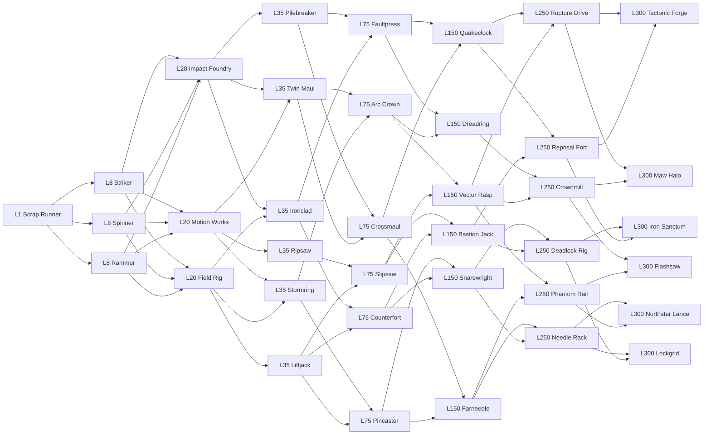

# Scrapcore Master Evolution Graph

**Status:** Approved master evolution graph with internal Impact Foundry and Motion Works prototypes; public Level 20 remains disabled

**Implementation baseline:** `d73d5a2796ef5b9f18d0447b81e78090a3b2d8db`

**Scope:** Original class identities, legal route structure, counterplay, and implementation planning. The graph remains capped at 37 nodes; prototype status is recorded here without enabling ordinary Level 20 access.

## Design contract

This plan treats evolution as a directed graph rather than a strict binary tree. Every life begins as Scrap Runner. Level 8 remains the implemented choice among Striker, Spinner, and Rammer, but that early weapon experiment does **not** restrict the Level 20 family choice. Level 20 is the first route commitment. From Level 35 onward, the server may offer only children connected to the player's current node. Shared hybrid nodes can accept multiple parents and can branch again later.

The approved Level 20 commitment uses **three**, rather than four, broad families. This is deliberate: every Level 8 class must reach every Level 20 family, while no node should offer more than three immediate choices. Three families satisfy both constraints without a special-case four-card choice. Charging and high-mobility burst remain a major branch inside Motion Works instead of consuming an entire family slot.

The existing provisional Pilebreaker, Twin Maul, Stormring, Ripsaw, Ironclad, and Liftjack concepts are retained as Level 35 concepts instead of Level 20 families. The checked-in route configuration records the complete approved 37-node graph. Only the three Level 8 classes are publicly selectable; Impact Foundry and Motion Works are internal Studio prototypes, while Field Rig and every later node remain unavailable.

## Current implementation status

- `EvolutionRouteService` owns the current node, Level 20 family commitment, reached gates, Level 8 ancestry, and run serial on the server. Replicated attributes are presentation only and are rewritten if a client attempts to forge them.
- Every Level 8 class has a legal edge to all three Level 20 families. The server validates the configured parent-to-child edge, exact gate, run serial, living Arena state, availability, request shape, and request rate.
- Impact Foundry and Motion Works have separate playable Studio prototypes. Each can be activated only by an authorized Studio developer action after a valid Level 8 selection and Level 20 eligibility.
- Field Rig remains graph data only. Ordinary players see Level 20 as under construction, and no Level 20 route is publicly selectable.
- Death, extraction, lobby return, disconnect, respawn, and a new run clear the complete route commitment.

Run rules remain unchanged:

- Evolution spends neither XP nor upgrade points.
- Upgrade ranks remain independent of class evolution.
- Death, successful extraction, lobby return, or starting a new run clears the complete route.
- Level 300 is the last evolution gate and the last level allowed to grant power.
- Levels above 300 provide score only.
- All eligibility, route state, combat behavior, effects, targets, damage, control, rewards, and reset behavior must remain server-authoritative.
- Permanent profile progression must never grant combat power or unlock paid statistical shortcuts.
- Selecting a Level 20 family completely replaces the Level 8 weapon and ability kit. Attacks, abilities, controllers, and combat modifiers do not stack across gates.
- A restrained ancestry accent may remain for visual continuity only; it must not imply or preserve an old combat capability.
- Initial ranged attacks use server-authoritative raycasts. Clients may render cosmetic projectile travel, but cannot determine trajectory, impact time, hit, damage, or target. Physical projectiles require a later explicit mechanic and approval.
- Control never hard-stuns, removes player input, or disrupts the camera. Slows, pushes, pulls, and zones must be short, bounded, server-owned, and protected by immunity windows or diminishing returns.
- Defensive mechanics remain damageable and directional. They cannot provide long invulnerability, unlimited reflection, or unavoidable retaliation.
- Thirty-seven nodes are the planning ceiling for the first complete graph. A new node requires replacing or merging an existing proposal rather than silently expanding scope.
- Impact Foundry is the first implementation prototype, but Level 20 remains disabled for ordinary players until Impact Foundry, Motion Works, and Field Rig are all implemented and validated.

## Complete graph

## Tier summary

| Required level | Node count | Purpose |
|---:|---:|---|
| 1 | 1 | Run baseline |
| 8 | 3 | Implemented early weapon and playstyle experiment |
| 20 | 3 | Unrestricted family commitment |
| 35 | 6 | First focused specialization |
| 75 | 6 | Mechanic refinement and first strong hybrids |
| 150 | 6 | Mature build identity |
| 250 | 6 | Pre-final convergence |
| 300 | 6 | Transformative but defeatable final evolution |
| **Total** | **37** | **One baseline plus 36 evolution nodes** |

The tables below combine related required fields to stay reviewable. “Identity / weapon” covers the short fantasy and primary weapon or ability. “Fight” covers core strength, core weakness, and counterplay. “Production” covers farming behavior, silhouette, reusable systems, new technical systems, and complexity.

## Level 1 and Level 8 nodes

| Internal ID / display | Level and allowed parents | Tags / range | Identity / weapon | Fight | Production |
|---|---|---|---|---|---|
| `ScrapRunner` / Scrap Runner | 1; new run only | Generalist, impact; close | Compact salvage bot with one standard front hammer. | **Strength:** Flexible timing and upgrades. **Weakness:** No specialized engagement tool. **Counterplay:** Bait the swing and punish recovery. | **Farming:** Baseline single-target route. **Silhouette:** Accepted rectangular chassis and modest hammer. **Reuse:** Existing chassis, hammer, movement, combat. **New:** None. **Complexity:** Low, implemented. |
| `Striker` / Striker | 8; `ScrapRunner` | Impact, disruption; close | Reinforced single-maul robot delivering reliable burst and shove. | **Strength:** Decisive accurate hit. **Weakness:** Slow recovery. **Counterplay:** Evade the arc and retaliate after commitment. | **Farming:** Existing reliable single-target breakable damage. **Silhouette:** Heavy rectangular hammer and amber accent. **Reuse:** Existing Hammer and class systems. **New:** None. **Complexity:** Low, prototyped. |
| `Spinner` / Spinner | 8; `ScrapRunner` | Rotary, pressure; close contact | Low front flywheel that sustains pressure while held. | **Strength:** Multi-target contact damage. **Weakness:** Spin-up, low shove, spacing vulnerability. **Counterplay:** Break contact and punish spin-down. | **Farming:** Existing sustained and clustered scrap clearing with target cap. **Silhouette:** Exposed asymmetric flywheel and purple accent. **Reuse:** Existing Spinner service and visuals. **New:** None. **Complexity:** Medium, prototyped. |
| `Rammer` / Rammer | 8; `ScrapRunner` | Mobility, impact; close to short-mid | Low wedge holds charge, then releases one aligned dash impact. | **Strength:** Closing burst and shove. **Weakness:** Reduced steering and miss recovery. **Counterplay:** Sidestep, use walls, and punish the missed lane. | **Farming:** Existing high-impact scrap crushing. **Silhouette:** Low wedge, asymmetric rails, orange accent. **Reuse:** Existing Rammer lease, dash, and validation. **New:** None. **Complexity:** High, prototyped. |

## Level 20 family nodes

Every Level 8 node may select every node in this tier. Selecting one family replaces the Level 8 attack kit for the remainder of that life unless a later design explicitly preserves a cosmetic legacy accent. It does not reset upgrades.

| Internal ID / display | Level and allowed parents | Tags / range | Identity / weapon | Fight | Production |
|---|---|---|---|---|---|
| `ImpactFoundry` / Impact Foundry | 20; `Striker`, `Spinner`, `Rammer` | Impact, defense; close | Rebuilds the front of the chassis around a visible impulse block and interchangeable striking face. | **Strength:** Readable burst and frontal stability. **Weakness:** Telegraph and recovery. **Counterplay:** Attack off-axis or during the reset cycle. | **Farming:** Strong deliberate single-target hits, limited cluster value. **Silhouette:** Tall front impulse block, broad braces, exposed rear. **Reuse:** Hammer timing, Rammer facing/query, knockback limits. **New:** Family loadout replacement. **Complexity:** Medium. |
| `MotionWorks` / Motion Works | 20; `Striker`, `Spinner`, `Rammer` | Rotary, mobility; close | Converts the front mount into an energy-limited powered carriage with two traction rollers and repeated narrow contact pulses. | **Strength:** Maintains initiative and threatens aligned moving targets. **Weakness:** Directional commitment, vulnerable spool, reduced high-output steering, and forced energy downtime. **Counterplay:** Change direction, use cover, break the frontal lane, and punish coastdown. | **Farming:** Sustained aligned scrap contact with a two-target cap and effective-damage credit. **Silhouette:** Low moving carriage, exposed drive belt, swept side guards, lime energy indicator. **Reuse:** Spinner lease/pulses and Rammer movement authorization. **New:** Server-owned energy and movement-dependent damage. **Complexity:** High, Studio prototype. |
| `FieldRig` / Field Rig | 20; `Striker`, `Spinner`, `Rammer` | Precision, control; mid | Mounts a crude coil caster and one bounded utility socket for shots or short-lived field devices. | **Strength:** Shapes approaches and pressures beyond melee reach. **Weakness:** Reload exposure, low shove, and vulnerable close quarters. **Counterplay:** Close through the telegraph, use walls, and attack during reload or device expiry. | **Farming:** Precise but exposure-limited; line of sight, reloads, and effective-damage accounting prevent safe farming. **Silhouette:** Offset coil barrel, utility rack, thin frontal armor. **Reuse:** Server spatial queries, LOS, breakable accounting. **New:** Server raycast authorization, cosmetic client tracer broadcast, and owned deployable framework. **Complexity:** High. |

## Level 35 nodes

| Internal ID / display | Level and allowed parents | Tags / range | Identity / weapon | Fight | Production |
|---|---|---|---|---|---|
| `Pilebreaker` / Pilebreaker | 35; `ImpactFoundry` | Impact, armor break; close | Vertical industrial driver stores force for one narrow downward strike. | **Strength:** Punishes slow or cornered targets. **Weakness:** Obvious preparation and long reset. **Counterplay:** Move laterally and retaliate after the driver falls. | **Farming:** Excellent on one durable object, poor travel and clusters. **Silhouette:** Tall nose tower and central driver. **Reuse:** Hammer timing/query. **New:** Vertical driver animation and narrow impact volume. **Complexity:** Medium. |
| `TwinMaul` / Twin Maul | 35; `ImpactFoundry`, `MotionWorks` | Impact, rotary hybrid; close | Two offset compact mauls alternate across different lanes. | **Strength:** Repeated coverage without one giant cooldown. **Weakness:** Lower peak burst and difficult disengagement. **Counterplay:** Read the active side and exit through the timing gap. | **Farming:** Steady two-lane object damage, limited area. **Silhouette:** Broad shoulders and staggered hammer heads. **Reuse:** Hammer swing broadcast and cooldown framework. **New:** Alternating authoritative attack index. **Complexity:** Medium. |
| `Stormring` / Stormring | 35; `MotionWorks`, `FieldRig` | Rotary, area control; close | Segmented guard ring powers only one or two visible arcs at a time. | **Strength:** Holds contested space and deters predictable entry. **Weakness:** Inactive gaps and weak pursuit. **Counterplay:** Enter through an unpowered segment or force relocation. | **Farming:** Good when objects cluster inside legal arcs; strict target caps. **Silhouette:** Wide broken ring with bright powered segments. **Reuse:** Spinner pulses and LOS. **New:** Directional segment schedule. **Complexity:** High. |
| `Ripsaw` / Ripsaw | 35; `MotionWorks` | Rotary, pursuit; close contact | Low forward cutter gains pressure only while aligned and moving into contact. | **Strength:** Chases retreating targets. **Weakness:** Narrow front, poor side coverage. **Counterplay:** Cut across its turn radius or break line around cover. | **Farming:** Fast along aligned lanes, loses output during realignment. **Silhouette:** Triangular nose around a low exposed cutter. **Reuse:** Spinner pulses and movement facing. **New:** Server-observed pursuit alignment. **Complexity:** Medium. |
| `Ironclad` / Ironclad | 35; `ImpactFoundry`, `FieldRig` | Defense, counter; close | Broad absorbing plow braces briefly, reducing frontal displacement before a modest counter shove. | **Strength:** Survives predictable frontal commitments. **Weakness:** Slow turning, exposed rear, limited chase. **Counterplay:** Withhold the hit, flank, or disengage until the brace ends. | **Farming:** Safe but deliberately slow; no bonus from absorbing object damage. **Silhouette:** Broad armored prow and visible rear machinery. **Reuse:** Damage notification and Rammer bracing visuals. **New:** Bounded directional mitigation window. **Complexity:** High. |
| `Liftjack` / Liftjack | 35; `FieldRig` | Mobility, control; close | Twin forks and a central jack deliver a short aligned lift-and-shove pulse without enabling physical collision. | **Strength:** Repositions one target for walls or teammates. **Weakness:** Low damage and exact alignment requirement. **Counterplay:** Approach off-axis and punish the fork reset. | **Farming:** Utility-first; effective damage remains modest. **Silhouette:** Narrow forks beneath a bright hydraulic block. **Reuse:** Rammer frontal query and knockback. **New:** Short bounded lift impulse with ceiling safety. **Complexity:** High. |

## Level 75 nodes

| Internal ID / display | Level and allowed parents | Tags / range | Identity / weapon | Fight | Production |
|---|---|---|---|---|---|
| `Faultpress` / Faultpress | 75; `Pilebreaker`, `Ironclad` | Impact, denial; close to short-mid | A grounded press drives a visible fracture pulse forward after a heavy windup. | **Strength:** Controls a narrow lane and cracks grouped targets. **Weakness:** Must stay grounded and telegraphs the lane. **Counterplay:** Leave the marked strip or attack from the side. | **Farming:** Strong against aligned objects; capped area damage and effective XP. **Silhouette:** Wide footplate, vertical piston, glowing ground guide. **Reuse:** Hammer impact and bounded spatial queries. **New:** Ground-constrained line pulse. **Complexity:** High. |
| `Crossmaul` / Crossmaul | 75; `Pilebreaker`, `TwinMaul` | Impact, coverage; close | Perpendicular mauls let the player commit to a forward or lateral swing lane. | **Strength:** Flexible close-range answer. **Weakness:** Wrong-lane prediction creates a full punish window. **Counterplay:** Feint movement and cross the inactive lane. | **Farming:** Consistent but never multi-lane in one attack. **Silhouette:** One long and one short orthogonal hammer. **Reuse:** Existing Hammer controller and server query. **New:** Server-owned lane choice from aim/facing, not a target. **Complexity:** Medium. |
| `ArcCrown` / Arc Crown | 75; `TwinMaul`, `Stormring` | Rotary, defense; close | Three crown segments rotate, but only the leading segment deals damage. | **Strength:** Predictable moving guard zone. **Weakness:** Two readable safe gaps and spin-up. **Counterplay:** Track the live segment and strike through a gap. | **Farming:** Moderate clustered clearing with one active arc and strict cap. **Silhouette:** Three raised blades around an open center. **Reuse:** Spinner rotation/pulses. **New:** Authoritative active-sector reconciliation. **Complexity:** High. |
| `Slipsaw` / Slipsaw | 75; `Ripsaw`, `Liftjack` | Mobility, rotary; close to short-mid | A side-mounted saw rides one short continuous lateral drive burst. | **Strength:** Hits an unexpected angle and disengages. **Weakness:** Fixed burst lane and downtime after a miss. **Counterplay:** Anticipate the lateral line and punish its endpoint. | **Farming:** Fast between separated targets, contact window remains short. **Silhouette:** Offset cutter and one bright side rail. **Reuse:** Rammer dash authorization and Spinner hit history. **New:** Side-dash validation. **Complexity:** High. |
| `Pincaster` / Pincaster | 75; `Stormring`, `Liftjack` | Precision, control; mid | A charged scrap pin briefly biases one target's movement direction without rooting it or removing input. | **Strength:** Creates a short, readable opening. **Weakness:** Narrow shot, low damage, long reload. **Counterplay:** Break LOS, dodge the pin, or pressure during reload. | **Farming:** Low raw DPS; precision may finish weak objects without overkill credit. **Silhouette:** Long single coil tube and visible pin magazine. **Reuse:** LOS, server raycasts, cosmetic tracers, and damage accounting. **New:** Short bounded directional pull with immunity or diminishing returns. **Complexity:** Experimental. |
| `Counterfort` / Counterfort | 75; `Ironclad`, `Liftjack` | Defense, counter; close | Deploys a brief frontal brace that stores a capped fraction of shove for one counter pulse. | **Strength:** Discourages obvious frontal burst. **Weakness:** Does little if opponents wait or flank. **Counterplay:** Bait the brace and attack after expiry. | **Farming:** Defensive mechanic gives no object-derived charge. **Silhouette:** Hinged front shield and exposed counterweight. **Reuse:** Damage notifications and knockback. **New:** Server-owned guard cone and capped stored impulse. **Complexity:** High. |

## Level 150 nodes

| Internal ID / display | Level and allowed parents | Tags / range | Identity / weapon | Fight | Production |
|---|---|---|---|---|---|
| `Quakeclock` / Quakeclock | 150; `Faultpress`, `Crossmaul` | Impact, timing; close to short-mid | A clockwork hammer marks its strike lane, then lands at a fixed server time. | **Strength:** Forces movement and rewards prediction. **Weakness:** Cannot retarget late. **Counterplay:** Leave the telegraph and attack during rewind. | **Farming:** Strong deliberate hit, delayed cycle limits throughput. **Silhouette:** Oversized geared hammer and visible timing dial. **Reuse:** Hammer broadcast and server time sync. **New:** Delayed locked-transform impact. **Complexity:** High. |
| `Dreadring` / Dreadring | 150; `Faultpress`, `ArcCrown` | Rotary, area pressure; close | Heavy segmented ring alternates damaging arcs with concussive but non-damaging guard arcs. | **Strength:** Sustained space control with readable phase changes. **Weakness:** Slow acceleration and predictable gaps. **Counterplay:** Enter on guard-only arcs or attack from range. | **Farming:** Good clusters only during damage arcs; capped targets. **Silhouette:** Thick broken ring with alternating materials. **Reuse:** Spinner and Stormring sector logic. **New:** Phase scheduler. **Complexity:** High. |
| `VectorRasp` / Vector Rasp | 150; `ArcCrown`, `Slipsaw` | Mobility, rotary; close to short-mid | A forward rasp spins only during one server-authorized vector burst. | **Strength:** Converts a planned line into contact pressure. **Weakness:** No sustained spin while stationary and little steering. **Counterplay:** Sidestep and punish the endpoint. | **Farming:** Efficient lanes, weak when routes require turns. **Silhouette:** Narrow rasp nose and long illuminated vector rails. **Reuse:** Spinner pulses plus Rammer dash window. **New:** Composite dash/pulse state machine. **Complexity:** High. |
| `Farneedle` / Farneedle | 150; `Crossmaul`, `Pincaster` | Precision, impact; mid to long | A braced coil lance fires one high-velocity scrap spike after a visible charge. | **Strength:** Rewards aim and punishes exposed lanes. **Weakness:** Nearly stationary charge, narrow shot, long reload. **Counterplay:** Use cover, close during charge, or juke before lock. | **Farming:** Accurate single-target reach, low rate and no blind penetration. **Silhouette:** Long central barrel with folding ground brace. **Reuse:** Server time, LOS, target validation. **New:** Server raycast with client-only cosmetic spike travel. **Complexity:** High. |
| `Snarewright` / Snarewright | 150; `Pincaster`, `Counterfort` | Traps, control; mid | Places at most two visible scrap clamps that apply a short bounded slow when crossed. | **Strength:** Shapes routes and protects an approach. **Weakness:** Devices are visible, destructible, and limited. **Counterplay:** Destroy, avoid, or deliberately trigger them before engaging. | **Farming:** Traps must not passively farm; object damage is negligible. **Silhouette:** Rear clamp rack and two deployment arms. **Reuse:** Breakable lifecycle and server ownership. **New:** Per-player deployable quota and bounded slow service. **Complexity:** Experimental. |
| `BastionJack` / Bastion Jack | 150; `Slipsaw`, `Counterfort` | Defense, mobility; close | A braced jack absorbs capped frontal momentum, then releases it as a short escape shove. | **Strength:** Survives and exits one committed engagement. **Weakness:** Low offense and vulnerable sides. **Counterplay:** Attack diagonally or wait out the brace. | **Farming:** Slow but safe; no stored power from breakables. **Silhouette:** Low side braces and a large rear recoil spring. **Reuse:** Guard cone, knockback, dash allowance. **New:** Guard-to-escape state transition. **Complexity:** High. |

## Level 250 nodes

| Internal ID / display | Level and allowed parents | Tags / range | Identity / weapon | Fight | Production |
|---|---|---|---|---|---|
| `RuptureDrive` / Rupture Drive | 250; `Quakeclock`, `VectorRasp` | Impact, mobility; close to short-mid | A continuous armored drive ends in one server-timed rupture strike along its traveled lane. | **Strength:** Commits through a lane and threatens one decisive endpoint. **Weakness:** Highly visible path and severe miss recovery. **Counterplay:** Leave the lane early and punish the stop. | **Farming:** Strong aligned route, costly realignment. **Silhouette:** Long impact spine, front ram block, trailing fault lights. **Reuse:** Rammer dash and Quakeclock timing. **New:** Swept displacement budget and endpoint area query. **Complexity:** High. |
| `Crownmill` / Crownmill | 250; `Dreadring`, `VectorRasp` | Rotary, area; close | A broad crown rotor has three attack windows separated by large safe gaps. | **Strength:** Highest sustained nearby pressure when centered correctly. **Weakness:** Huge silhouette, startup, and exploitable gaps. **Counterplay:** Range it or move through a safe sector. | **Farming:** Excellent clusters; target cap and layout risk require profiling. **Silhouette:** Wide mill crown with three missing sections. **Reuse:** Spinner sector pulses. **New:** Larger query budget and low-end performance safeguards. **Complexity:** High. |
| `NeedleRack` / Needle Rack | 250; `Farneedle`, `Snarewright` | Precision, arsenal; mid to long | Selects one of three narrow barrel lanes and fires a bounded staggered volley. | **Strength:** Controls a chosen lane and pressures multiple exposed targets. **Weakness:** Visible barrel selection, limited magazine, long reload. **Counterplay:** Read the active rack, use cover, then push during reload. | **Farming:** Good lined targets but no penetration or overkill XP. **Silhouette:** Three offset barrels and exposed rotating magazine. **Reuse:** Server raycasts, cosmetic tracers, and Pincaster validation. **New:** Server magazine/reload state. **Complexity:** High. |
| `DeadlockRig` / Deadlock Rig | 250; `Snarewright`, `BastionJack` | Traps, battlefield control; mid | Places up to three destructible pylons; two nearby pylons create one visible short-lived slow lane. | **Strength:** Reshapes a local fight. **Weakness:** Setup time, strict radius, destructible anchors. **Counterplay:** Break one pylon, fight elsewhere, or rush before the network forms. | **Farming:** No passive XP engine; pylon damage is minimal and capped. **Silhouette:** Tall folded pylons and cable-spool frame. **Reuse:** Deployable ownership and breakable health. **New:** Validated pylon graph and field lifetime. **Complexity:** Experimental. |
| `ReprisalFort` / Reprisal Fort | 250; `Quakeclock`, `BastionJack` | Defense, counter-impact; close | A visible frontal gate can catch one legal impact and answer with a capped directed press. | **Strength:** Punishes predictable burst once. **Weakness:** Slow, directional, and useless after the catch is spent. **Counterplay:** Feint, hit from the rear, or consume the gate with a low-value attack. | **Farming:** Catch never charges from objects. **Silhouette:** Tall split gate and central return piston. **Reuse:** Authoritative damage events and Counterfort storage. **New:** One-hit interception token without damage reflection. **Complexity:** Experimental. |
| `PhantomRail` / Phantom Rail | 250; `Farneedle`, `VectorRasp` | Mobility, precision; mid to long | Executes a short continuous boost, locks facing, then fires one precision rail spike from the stop point. | **Strength:** Creates an angle and immediately threatens it. **Weakness:** Predictable endpoint, fixed firing delay, fragile at close range. **Counterplay:** Track the boost endpoint and contest before the shot. | **Farming:** Fast traversal but deliberate single shots. **Silhouette:** Slim rail barrel over twin glowing boost rails. **Reuse:** Dash authorization, server raycasts, and cosmetic tracers. **New:** Server-owned boost-to-shot sequence. **Complexity:** High. |

## Level 300 final nodes

| Internal ID / display | Level and allowed parents | Tags / range | Identity / weapon | Fight | Production |
|---|---|---|---|---|---|
| `TectonicForge` / Tectonic Forge | 300; `RuptureDrive`, `ReprisalFort` | Ultimate impact, counter; close to short-mid | A colossal front forge converts one fully telegraphed commitment into a lane-breaking hammer-ram strike. | **Strength:** Transformative single impact and shove. **Weakness:** Long tell, narrow lane, longest recovery in the graph. **Counterplay:** Leave the lane or trigger the commitment safely, then collapse during recovery. | **Farming:** One durable target or aligned group; strict target cap and no excess XP. **Silhouette:** Massive glowing forge block and grounded rear outriggers. **Reuse:** Rammer, Hammer, guarded-impact systems. **New:** Composite strike with absolute damage/displacement caps. **Complexity:** High. |
| `MawHalo` / Maw Halo | 300; `RuptureDrive`, `Crownmill` | Ultimate rotary, area; close | Three independently timed rotor jaws orbit an open center, leaving rotating safe corridors. | **Strength:** Transformative contact pressure and local denial. **Weakness:** Long spin-up, large profile, ranged vulnerability, readable corridors. **Counterplay:** Attack through a safe corridor or force it to chase. | **Farming:** Highest cluster-risk candidate; six-target cap, effective damage, and map profiling mandatory. **Silhouette:** Three separated jaw arcs around an exposed core. **Reuse:** Spinner and Crownmill sectors. **New:** Multi-rotor synchronization under one bounded update loop. **Complexity:** Experimental. |
| `NorthstarLance` / Northstar Lance | 300; `NeedleRack`, `PhantomRail` | Ultimate precision; long | Extends a long braced lance and paints the full firing line before one server-owned shot. | **Strength:** Exceptional lane threat and aim payoff. **Weakness:** Cannot turn late, obvious line, severe reload, exposed flanks. **Counterplay:** Break LOS, cross the line before lock, or rush during reload. | **Farming:** Strong exposed single targets but never safe blind farming or wall penetration. **Silhouette:** Extremely long center lance, folding side braces, bright line emitter. **Reuse:** Farneedle raycast and server-time telegraph. **New:** Long-range streaming/perception safeguards and cosmetic tracer reconciliation. **Complexity:** High. |
| `Lockgrid` / Lockgrid | 300; `NeedleRack`, `DeadlockRig` | Ultimate control, arsenal; mid | Four-shot magazine and up to three pylons combine into short-lived marked danger cells, never hard roots. | **Strength:** Plans a battlefield and punishes repeated routes. **Weakness:** Setup, reloads, destructible anchors, weak when displaced. **Counterplay:** Break anchors, rotate away, or pressure between magazines. | **Farming:** Devices cannot auto-farm; direct shots retain effective-damage accounting. **Silhouette:** Grid-shaped overhead rack and three visible folded pylons. **Reuse:** NeedleRack and DeadlockRig services. **New:** Audited cell intersection and combined quota budgets. **Complexity:** Experimental. |
| `Flashsaw` / Flashsaw | 300; `Crownmill`, `PhantomRail` | Ultimate mobility, rotary; close to short-mid | Chains a small bounded number of continuous boost cuts; it never teleports and each lane is visibly projected. | **Strength:** Transformative angle changes and pursuit. **Weakness:** Limited chain count, little steering per burst, vulnerable final endpoint. **Counterplay:** Read projected lanes, use walls, and punish the last stop. | **Farming:** Fast route potential requires travel-versus-combat benchmarking. **Silhouette:** Narrow central saw, three sequentially lit drive rails. **Reuse:** Spinner pulse history and authorized dash windows. **New:** Server-owned chained displacement budget. **Complexity:** Experimental. |
| `IronSanctum` / Iron Sanctum | 300; `DeadlockRig`, `ReprisalFort` | Ultimate defense, control; close to mid | Deploys heavy directional braces and one destructible anchor, creating a temporary defendable position rather than invulnerability. | **Strength:** Holds one objective and enables counterplay for allies. **Weakness:** Very slow, rear exposure, finite brace duration, movable fight can ignore it. **Counterplay:** Rotate away, destroy the anchor, attack uncovered angles, or wait out the state. | **Farming:** Lowest expected clear speed; durability must not create passive reward. **Silhouette:** Wide folding armor walls around an exposed rear core. **Reuse:** Reprisal guard and deployable ownership. **New:** Directional team-readable protection state. **Complexity:** Experimental. |

## Legal parent-to-child transitions

This table is authoritative for the proposal and is intentionally redundant with the diagram so discrepancies can be caught during review.

| From level | Parent ID | To level | Legal child IDs |
|---:|---|---:|---|
| 1 | `ScrapRunner` | 8 | `Striker`, `Spinner`, `Rammer` |
| 8 | `Striker` | 20 | `ImpactFoundry`, `MotionWorks`, `FieldRig` |
| 8 | `Spinner` | 20 | `ImpactFoundry`, `MotionWorks`, `FieldRig` |
| 8 | `Rammer` | 20 | `ImpactFoundry`, `MotionWorks`, `FieldRig` |
| 20 | `ImpactFoundry` | 35 | `Pilebreaker`, `TwinMaul`, `Ironclad` |
| 20 | `MotionWorks` | 35 | `TwinMaul`, `Stormring`, `Ripsaw` |
| 20 | `FieldRig` | 35 | `Stormring`, `Ironclad`, `Liftjack` |
| 35 | `Pilebreaker` | 75 | `Faultpress`, `Crossmaul` |
| 35 | `TwinMaul` | 75 | `Crossmaul`, `ArcCrown` |
| 35 | `Stormring` | 75 | `ArcCrown`, `Pincaster` |
| 35 | `Ripsaw` | 75 | `Slipsaw` |
| 35 | `Ironclad` | 75 | `Faultpress`, `Counterfort` |
| 35 | `Liftjack` | 75 | `Slipsaw`, `Pincaster`, `Counterfort` |
| 75 | `Faultpress` | 150 | `Quakeclock`, `Dreadring` |
| 75 | `Crossmaul` | 150 | `Quakeclock`, `Farneedle` |
| 75 | `ArcCrown` | 150 | `Dreadring`, `VectorRasp` |
| 75 | `Slipsaw` | 150 | `VectorRasp`, `BastionJack` |
| 75 | `Pincaster` | 150 | `Farneedle`, `Snarewright` |
| 75 | `Counterfort` | 150 | `Snarewright`, `BastionJack` |
| 150 | `Quakeclock` | 250 | `RuptureDrive`, `ReprisalFort` |
| 150 | `Dreadring` | 250 | `Crownmill` |
| 150 | `VectorRasp` | 250 | `RuptureDrive`, `Crownmill`, `PhantomRail` |
| 150 | `Farneedle` | 250 | `NeedleRack`, `PhantomRail` |
| 150 | `Snarewright` | 250 | `NeedleRack`, `DeadlockRig` |
| 150 | `BastionJack` | 250 | `DeadlockRig`, `ReprisalFort` |
| 250 | `RuptureDrive` | 300 | `TectonicForge`, `MawHalo` |
| 250 | `Crownmill` | 300 | `MawHalo`, `Flashsaw` |
| 250 | `NeedleRack` | 300 | `NorthstarLance`, `Lockgrid` |
| 250 | `DeadlockRig` | 300 | `Lockgrid`, `IronSanctum` |
| 250 | `ReprisalFort` | 300 | `TectonicForge`, `IronSanctum` |
| 250 | `PhantomRail` | 300 | `NorthstarLance`, `Flashsaw` |

## Route commitment and blocking

The route model stores a server-owned current node plus the selected node at each completed gate. A future public client request may contain only a node ID and the displayed run serial; neither value is authoritative. At every gate the server verifies the exact level, current node, legal child edge, enabled status, living Arena session, canonical run serial, exact payload shape, and request rate. Replicated route attributes are presentation only.

Level 20 is deliberately special: eligibility is based on reaching Level 20, not on the Level 8 class. Any Level 8 class can enter any family. Once a family is accepted, every later choice is filtered by the current parent edge.

Examples:

- `Striker → FieldRig` is legal. If the player then chooses `Stormring`, Level 75 offers only `ArcCrown` and `Pincaster`; `Faultpress` is blocked.
- `Spinner → ImpactFoundry → Pilebreaker → Crossmaul → Farneedle → PhantomRail → Flashsaw` is legal even though Spinner began as a rotary Level 8 class.
- `Rammer → MotionWorks → Ripsaw → Slipsaw → BastionJack → DeadlockRig → IronSanctum` is legal and demonstrates a mobility route converging into defense/control.
- `FieldRig → Ripsaw` is illegal because no edge connects them.
- After choosing `TwinMaul`, `Pincaster` is illegal at Level 75; only `Crossmaul` or `ArcCrown` are legal.
- Selecting shared `ArcCrown` forgets which of its legal Level 35 parents was used for future filtering. Its Level 150 children are the same either way, avoiding hidden sub-routes.

Successful extraction, death, disconnect, canonical lobby return, and fresh deployment clear every selected gate. A stale request carrying a former run's node must fail against the current server run serial. Levels above 300 never open another choice.

## Shared and hybrid evolutions

Shared nodes keep the graph buildable and make families interact without erasing weaknesses:

- `TwinMaul` combines Impact Foundry's strikes with Motion Works' repeated cadence, but loses peak impact and clean disengagement.
- `Stormring` combines Motion Works' rotation with Field Rig's space control, but keeps readable inactive gaps.
- `Ironclad` combines Impact Foundry bracing with Field Rig's directional control, but sacrifices chase.
- `ArcCrown`, `VectorRasp`, `Farneedle`, `Snarewright`, and `BastionJack` are later convergence points with one mechanic inherited from each parent.
- Level 250 nodes deliberately converge two mature styles before Level 300. No final node simply owns every parent strength: Tectonic Forge is slow, Maw Halo has safe corridors, Northstar Lance exposes its firing line, Lockgrid needs setup, Flashsaw has bounded lanes, and Iron Sanctum can be ignored or flanked.

A shared node becomes the sole current parent after selection. It may branch again, but it does not retain both earlier parent nodes as hidden permissions.

## Combat-role and counterplay coverage

| Combat need | Representative nodes | Required counterplay invariant |
|---|---|---|
| Heavy single impact | Impact Foundry, Pilebreaker, Quakeclock, Tectonic Forge | Visible lane or windup plus meaningful miss recovery |
| Sustained rotary/contact | Motion Works, Stormring, Dreadring, Maw Halo | Spin-up, contact dependence, safe gaps, and range vulnerability |
| Charging/high-mobility burst | Ripsaw, Slipsaw, Vector Rasp, Rupture Drive, Flashsaw | Server-bounded continuous movement, projected lane, weak steering, endpoint punish |
| Ranged/precision pressure | Field Rig, Pincaster, Farneedle, Needle Rack, Northstar Lance | LOS, visible aim/charge, limited magazine or reload, close-range vulnerability |
| Area denial/traps | Stormring, Snarewright, Deadlock Rig, Lockgrid | Target caps, destructible devices, finite lifetime, no hard roots or passive farming |
| Defensive/counterplay | Ironclad, Counterfort, Bastion Jack, Reprisal Fort, Iron Sanctum | Directional and temporary defense, flank/reposition answer, no invulnerability |
| Hybrids | Twin Maul, Arc Crown, Vector Rasp, Phantom Rail, all Level 300 finals | Preserve at least one weakness from each contributing style |

Farming balance remains a separate evidence gate. Area and trap damage must use maximum target counts and contribution XP based on effective damage actually applied. Ranged attacks require exposure through charge, line of sight, ammunition, reload, or movement commitment. Defensive states must never generate XP by absorbing object damage.

## Technical reuse and implementation cost

| Foundation | Reused by | Cost and risk |
|---|---|---|
| Hammer authorization, server-time swings, spatial query | Impact Foundry, Pilebreaker, Twin Maul, Crossmaul, Quakeclock | Lowest-risk path; still needs generalized weapon definitions rather than class-specific duplication. |
| Spinner lease, managed update loop, pulse deduplication | Motion Works rotary branches, Stormring, Arc Crown, Dreadring, Crownmill, Maw Halo | Reusable, but sector logic and larger queries need strict target and performance budgets. |
| Rammer hold lease, dash authorization, movement allowance | Motion Works mobility branches, Slipsaw, Vector Rasp, Rupture Drive, Phantom Rail, Flashsaw | High anti-cheat sensitivity; every dash needs direction, speed, duration, displacement, and wall validation. |
| Authoritative damage notification and knockback | Defensive/counter branches | Mitigation and stored impulse must be inserted once in the damage pipeline, never independently in each weapon. |
| Breakable contribution accounting | Every damaging class | Always credit effective damage capped by remaining health; no overkill or passive trap XP. |
| New server-raycast ranged framework with client-only cosmetic projectiles | Field Rig, Pincaster, Farneedle, Needle Rack, Phantom Rail, Northstar Lance | High risk: authoritative origin/direction, LOS, range, fire timing, cosmetic reconciliation, streaming, and mobile aiming require a dedicated milestone. Physical projectile travel is excluded until a later mechanic explicitly requires it. |
| New owned-deployable framework | Snarewright, Deadlock Rig, Lockgrid, Iron Sanctum | Experimental: quotas, lifetime, cleanup, replication, destruction, and server performance must be proved with multiple players. |
| New bounded control-effect service | Liftjack, Pincaster, Snarewright, later control nodes | High fairness risk. Effects must be short, non-stacking or capped, visible, and cancelled on reset/death. |
| General route service and graph validation | Every post-Level-20 node | Required before any later class. It must reject disabled, unreachable, stale-run, duplicate, malformed, and client-forged choices. |

Highest-risk mechanics are Lockgrid's combined raycast/deployable cells, Maw Halo's multi-rotor query budget, Flashsaw's chained movement authorization, Reprisal Fort's damage interception, and Pincaster/Snarewright control effects. Control may never hard-stun, remove input, or disrupt the camera; repeated effects require immunity windows or diminishing returns. Defensive states may reduce bounded directional damage or displacement, but never grant long invulnerability, unlimited reflection, or unavoidable retaliation. None of these mechanics should be implemented before their shared technical foundation passes isolated multiplayer tests.

## Recommended implementation order

1. **Preserve the approved graph contract.** Three Level 20 families form the commitment tier, and the six existing provisional concepts move to Level 35 when configuration work is separately authorized.
2. **Prototype only the route-state framework plus Impact Foundry.** Add server-owned gate history, graph validation, reset behavior, one internal Level 20 UI, and one low-risk family loadout. This prototype must remain unavailable to ordinary players.
3. **Prototype Motion Works internally.** Reuse lease, pulse, and movement-authorization patterns without combining Level 8 attacks; keep its energy drive unavailable to ordinary players until multiplayer validation is complete.
4. **Implement Field Rig behind an isolated raycast prototype.** Prove server authority, cosmetic tracer reconciliation, mobile aiming, LOS, and farming exposure before enabling the family. Physical projectile travel remains deferred.
5. **Run a three-family Level 20 balance and farming gate.** Level 20 remains disabled for ordinary players until Impact Foundry, Motion Works, and Field Rig are all functional and validated. Do not start Level 35 until family selection, kit replacement, death/extraction reset, and counterplay pass multiplayer testing.
6. **Implement Level 35 one node at a time.** Start with Pilebreaker, then Ripsaw, then Field Rig's lowest-risk descendant; add shared hybrids only after both parent foundations are stable.
7. **Add later tiers only when pacing makes them observable.** Level 75 and beyond require real run-duration evidence, telemetry, and a sustainable asset/UI budget.
8. **Defer experimental finals.** Lockgrid, Maw Halo, Flashsaw, Reprisal Fort, and other compound mechanics should remain paper designs until their component systems are production-safe.

### Recommended first Level 20 milestone

Prototype **Impact Foundry** first, together with the minimum generic route service. It has the best implementation-to-learning ratio: its attack can reuse the validated Hammer and Rammer query/timing foundations, its counterplay is immediately readable, and selecting it from any Level 8 class proves the new unrestricted Level 20 commitment rule. The prototype completely replaces the Level 8 combat kit and may preserve only restrained ancestry visuals. It must remain unavailable to ordinary players, and the milestone must not implement Pilebreaker, Twin Maul, Ironclad, or any later gate. Level 20 can become publicly enabled only after Motion Works and Field Rig also pass their own multiplayer, security, input, farming, and balance gates.

## Validation audit

- **All Level 8 classes reach every Level 20 family:** confirmed by nine explicit edges.
- **Every post-Level-20 node has a legal parent:** confirmed in the transition table.
- **Every non-final node reaches Level 300:** confirmed; all Level 250 nodes have two final children, and every earlier node has at least one path to Level 250.
- **No incompatible route is reachable:** confirmed by current-node filtering; examples above cover valid shared convergence and invalid cross-family jumps.
- **Diagram and transition table agree:** confirmed for all 69 legal edges.
- **Node IDs are unique:** confirmed across 37 nodes.
- **All seven gates appear:** confirmed at Levels 8, 20, 35, 75, 150, 250, and 300.
- **Immediate choices are bounded:** confirmed; every non-final node has one to three children.
- **Existing behavior/configuration:** unchanged; this document is not executable and does not enable any class.

## Approved boundaries and remaining decisions

Approved:

1. Three broad Level 20 families preserve the three-choice maximum.
2. Pilebreaker, Twin Maul, Stormring, Ripsaw, Ironclad, and Liftjack move to Level 35 in the future configured graph.
3. Level 20 completely replaces the Level 8 combat kit; only restrained visual ancestry cues may remain.
4. Initial ranged systems use server-authoritative raycasts and client-only cosmetic projectile visuals. Physical projectiles require later explicit approval.
5. Control effects cannot hard-stun, remove input, or disrupt the camera; they remain short, bounded, server-authoritative, and protected against repeated chaining.
6. Defensive mechanics cannot create long invulnerability, unlimited reflection, or unavoidable retaliation.
7. Thirty-seven nodes are the planning ceiling for the first complete graph.
8. Impact Foundry and Motion Works are internal prototypes, but Level 20 remains disabled for ordinary players until all three families are functional and validated.

Also approved with the complete graph:

1. The names **Impact Foundry**, **Motion Works**, and **Field Rig**.
2. All 34 post-Level-8 node names, identities, parent links, and provisional complexity assessments shown above.
3. Shared-node behavior: after convergence, the selected shared node becomes the sole parent and does not retain hidden permissions from its earlier route.

Balance and implementation questions deliberately remain unresolved:

1. Whether each defensive counter reduces damage, displacement, or both within the approved no-invulnerability/no-unlimited-reflection boundary.
2. Whether Level 300 finals should be realistically reachable in ordinary 20–45 minute runs once full-route human pacing is measured.
3. Exact damage, timing, range, mobility, recovery, target caps, control strength, immunity windows, and farming modifiers for every unimplemented node.
4. Matchup, pick-rate, farming, and performance targets required before any family or later tier becomes player-facing.
